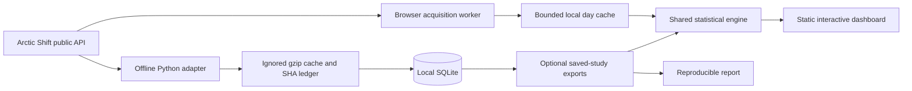

# Reddit Activity Lab

Explore **when a community is active, how crowded posting windows are, and whether timing patterns survive a later-period check**. Built by [Aaditya More](https://www.linkedin.com/in/aadityavmore/).

The dashboard now accepts **any subreddit covered by Arctic Shift**, with on-demand acquisition, source freshness checks, and a bounded browser cache. The deployment contains only static application code: no Reddit corpus, database server, Vercel Functions, paid storage, or cron jobs.

[Initial six-week findings](docs/initial-report.md) · [Methodology](docs/methodology.md) · [Source investigation](docs/sources.md) · [Hosting and scale](docs/hosting.md)

## Run locally

Requires Node.js 18+, Python 3.9+, and a modern browser with Web Workers, IndexedDB, Web Crypto, and IANA timezone support. The browser path uses the public Arctic Shift API without a Reddit login. There are no runtime npm dependencies.

```sh
git clone https://github.com/aaditya-v-more/reddit-activity-lab.git
cd reddit-activity-lab
npm test
npm run dev
```

Open [localhost:4317](http://127.0.0.1:4317), enter a subreddit, and choose local dates and a timezone. IST is the default. First loads can take minutes; subsequent loads reuse completed days. Use **7 days** or **1 day** for very active communities. Only complete acquisitions become findings.

## What “any subreddit” and “fresh” mean

- Subreddit names are not restricted to the original three. Prefix suggestions use the provider's directory, which can lag behind its record archive; direct name entry also works.
- Each acquisition is bounded to **93 days, 200,000 records, and 350 requests**. This is access to selected communities and intervals, not a continuously replicated all-Reddit database. Oversized intervals fail visibly and suggest a shorter range.
- The latest returned post/comment creation times are checked **every 5 minutes while the tab is visible**. These timestamps describe archive freshness, not online users or a complete capture watermark.
- Analysis checks run every **15 minutes while visible**. The last three completed local dates use a 15-minute cache; older dates expire after seven days. Manual **Refresh data** bypasses the cache. Nothing polls when the site is closed.
- The current local day is excluded from timing comparisons. Recent posts without a mature second snapshot contribute to activity, but not to performance. Archive delays and outages can prevent prompt updates; there is no guaranteed push notification from the provider.
- Browser storage holds anonymous day/hour aggregates, redacted public post evidence, and request provenance. It is capped at approximately **40 MB / 180 day entries**, subject to browser eviction. Author names are used transiently in the worker for distinct counts and are not persisted in that cache.

The interface distinguishes activity, participants, online users, and weekly visitors. Net score is not an exact upvote count. Eligible performance snapshots are **35–40 hours old**, not first-24-hour results. Timing relationships are observational.

## Product

- Subreddit discovery, inclusive local date filters, and eight IANA timezones.
- Comment, post, and distinct-participant heatmaps; daily, weekly, and monthly trends.
- Competition by four-hour submission window, median score, median comments, success thresholds, and sample sizes.
- Earlier-half candidate selection with a frozen threshold, followed by a later-half comparison and weekly bootstrap uncertainty.
- Searchable supporting posts, snapshot eligibility, archive freshness, per-day retrieval dates, and downloadable request hashes.
- Loading progress, cancellation, retry, explicit limits, unavailable data, and browser-cache controls.
- LinkedIn attribution and a GitHub source link, including in the mobile footer.

## Architecture



The worker requests one page at a time, spaces calls, respects retries, overlaps timestamp boundaries, and deduplicates record IDs using newer-observation precedence. Both post and comment acquisition must finish before a local day's anonymous aggregate enters the cache. Local-day boundaries come from IANA calendar rules, including IST's half-hour offset and DST's repeated/missing hours. Independent date partitions make recent refreshes smaller than a full re-download.

`dist/` is authored source, not disposable build output. `scripts/build.mjs` copies an explicit asset allowlist into `.output/` and excludes saved-study data. The same static output works on Vercel, Cloudflare Pages, or another static host. Archive requests go directly from the visitor's browser to Arctic Shift, so they do not use Vercel function CPU, database storage, or archive-response bandwidth. Provider limits and visitor bandwidth still apply.

| Layer                                          | Files                                                                         |
| ---------------------------------------------- | ----------------------------------------------------------------------------- |
| On-demand acquisition and normalization        | `dist/archive.js`                                                             |
| Background execution and bounded browser cache | `dist/archive-worker.js`                                                      |
| Statistics shared by UI, tests, and reports    | `dist/analysis.js`                                                            |
| Product interface                              | `dist/app.js`, `dist/index.html`, `dist/style.css`                            |
| Offline acquisition / SQLite / normalization   | `pipeline/`                                                                   |
| Static deployment allowlist                    | `scripts/build.mjs`, `vercel.json`, `.vercelignore`                           |
| Tests                                          | `tests/analysis.test.mjs`, `tests/archive.test.mjs`, `tests/test_pipeline.py` |

## Offline reproducibility and the original study

The original study contains **263,652 unique records: 19,507 posts and 244,145 comments** across r/ClaudeAI, r/ClaudeCode, and r/ollama, acquired for **27 July–6 September 2026 UTC**. Its default analysis covers **28 July–5 September**, 40 complete IST days. The compressed cache was 19.46 MB. These historical findings remain separate from new on-demand observations.

```sh
# Requires curl; end is exclusive and dates are UTC.
python3 -m pipeline.acquire --subreddits ClaudeAI ClaudeCode ollama \
  --start 2026-07-27 --end 2026-09-07
python3 -m pipeline.export
python3 -m pipeline.validate
node scripts/report.mjs

# Rebuild normalization from checksum-verified cached responses, without network.
python3 -m pipeline.rebuild

# Optional small reverse-order source checks.
python3 -m pipeline.validate --online
```

After exporting, the local UI offers **Saved six-week study** as a separate source. Hosted builds omit it. Safe reruns skip completed acquisitions, deduplicate overlap, and retain newer snapshots. Failed intervals do not receive completion flags. A fresh acquisition can differ from the original study because archives change.

The offline source adapter remains replaceable. Map score measurement timestamps only when the source actually supplies them; an ingestion timestamp must not become a supposed fixed-age outcome.

## Verification

`npm test` runs **30 tests without downloaded records** and one additional integration test when saved exports exist. Tests cover pagination ties, newer snapshots, failure completion flags, moderation restoration, bot/deleted-author handling, distinct unions, IST/DST boundaries, cache freshness, acquisition failure handling, Wilson intervals, weekly resampling, and temporal selection leakage.

The on-demand path was also exercised against actual records from **r/ollama and r/LocalLLaMA** for 10 September 2026 IST, acquiring 242 and 3,744 records respectively. Counts reconcile across posts, heatmaps, and daily totals. The original study's [audit](docs/validation.json) records checksum, identity-parity, and 12 reverse-order source checks. Neither audit proves complete Reddit capture.

## Deployment

```sh
npm run build
# Preview only; choose your own account scope when linking.
vercel link
vercel deploy
```

Use the Hobby plan for this personal project. No sub-daily Vercel cron job is configured. The project does not deploy to ChatGPT Sites. See [hosting and free-plan constraints](docs/hosting.md) for the deployment footprint and fallback options.

The GitHub source is public; raw responses, SQLite, `dist/data/`, local deployment configuration, and personal-post notes are ignored. Public source availability does not grant redistribution rights to Reddit content. See [data handling](docs/data-policy.md).

## Explain it in an interview

Discuss the measured 263,652-record study, two independently exercised acquisition paths, eight-timezone analysis, overlap-safe pagination, snapshot-age eligibility, temporal holdout diagnostics, bounded incremental caching, and a static deployment with no server compute. Do not claim improved Reddit engagement: no prospective posting experiment has been completed.
