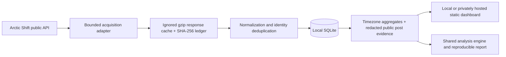

# Reddit Activity Lab

A reproducible Reddit analytics workbench for deciding **where to post, when to test, and how much to trust the evidence**. Built by **[Aaditya More](https://www.linkedin.com/in/aadityavmore/)**.

This public repository contains the application, acquisition pipeline, tests, methodology, and aggregate study findings. Reddit records, dashboard data exports, personal-post notes, and deployment configuration remain local and are excluded from the public Git history. Acquire a bounded dataset to run your own dashboard; no demo data is presented as evidence.

The delivered study uses actual Arctic Shift posts and comments from r/ClaudeAI, r/ClaudeCode, and r/ollama. Acquisition spans **27 July–6 September 2026 UTC** (7 September exclusive). The default dashboard selects **28 July–5 September**, 40 complete local days, with **Asia/Kolkata** as the default timezone.

The extract contains **263,652 unique records** and occupies **19.46 MB compressed** locally. Twenty-two automated tests pass; 12 independent reverse-order source spot checks match exact IDs.

Read the generated [initial findings](docs/initial-report.md), [source investigation](docs/sources.md), [methodology](docs/methodology.md), and [verification results](docs/validation.json). No demonstration records are mixed into findings. Synthetic fixtures exist only in tests.

## Run locally

Requires Python 3.9+ with system IANA timezone data, Node.js 18+, and curl. There are **no runtime package dependencies or package-install step**.

```sh
git clone https://github.com/aaditya-v-more/reddit-activity-lab.git
cd reddit-activity-lab
npm test

# Start with one community and one week; no Reddit login required.
python3 -m pipeline.acquire --subreddits ollama \
  --start 2026-08-24 --end 2026-08-31
python3 -m pipeline.export
npm run dev
```

Open [the local dashboard](http://127.0.0.1:4317). It binds only to loopback. The dashboard reads the exports generated in the ignored `dist/data/` directory. Without exports, it shows an unavailable-data state with setup guidance. Acquisition depends on the source's continued availability; a fresh download can differ from the original study as archive records change.

To reproduce the full study scope:

```sh
# Fetch a bounded interval. End is exclusive; dates are interpreted as UTC.
python3 -m pipeline.acquire --subreddits ClaudeAI ClaudeCode ollama \
  --start 2026-07-27 --end 2026-09-07

# Normalize cached data again after a normalization change; no network.
python3 -m pipeline.rebuild

# Export only paired, completed post/comment intervals.
python3 -m pipeline.export

# Statistical/timezone tests, offline data audit, reproducible report.
npm test
python3 -m pipeline.validate
node scripts/report.mjs

# Optional: independently re-query 12 bounded intervals in descending order.
python3 -m pipeline.validate --online
```

Completed acquisitions are skipped on rerun. Use `--refresh` to deliberately revisit records. Request caches are checksum-verified; identity keys deduplicate overlap. Newer archive observations supersede older ones. A failed acquisition does not produce a completed coverage flag. A saturated same-second page fails visibly instead of silently skipping tied timestamps.

## What the product does

- Switch communities, inclusive local dates, and eight IANA timezones.
- Compare hourly/day-of-week comments, submissions, and distinct participants.
- Inspect daily trends, competing submissions, weekly and monthly changes.
- Compare four-hour submission windows using median net score, median comments, explicit success thresholds, sample sizes, and uncertainty.
- Select a candidate using the earlier half of the period and inspect its later performance with a frozen threshold.
- Search, filter, sort, and paginate the actual supporting post records.
- Inspect source coverage, exclusion reasons, snapshot timestamps, and provenance.
- Handle unavailable data, empty ranges, sparse samples, invalid dates, and request failures.
- Expose the same aggregate analysis and filter actions through optional WebMCP tools, with progressive enhancement in browsers that support them.

The product never equates participation with online users, net score with exact upvotes, or archive snapshots with first-24-hour performance. No Reddit credentials, browser-session tokens, or private views are required.

## Architecture



SQLite is suitable for this bounded dataset, portable across machines, and requires no separate service. Python's `zoneinfo` handles calendar boundaries during aggregation. Native JavaScript modules keep the application lightweight; the identical statistical engine powers the dashboard, report, and automated tests. Static private hosting avoids a database server and keeps author-level participation records off the website.

| Layer         | Files                                              | Contract                                                                            |
| ------------- | -------------------------------------------------- | ----------------------------------------------------------------------------------- |
| Acquisition   | `pipeline/acquire.py`                              | Public source adapter, bounded cursor traversal, retries, hash ledger               |
| Normalization | `pipeline/store.py`, `pipeline/rebuild.py`         | Stable `(kind, id)` identity, timestamps, moderation restoration, update precedence |
| Storage       | ignored `data/reddit.sqlite`, `data/raw/`          | Local provenance and public archive responses                                       |
| Aggregation   | `pipeline/export.py`                               | Anonymous local date/hour counts and redacted post evidence                         |
| Analysis      | `dist/analysis.js`                                 | Quantiles, Wilson intervals, temporal split, weekly resampling                      |
| Product       | `dist/app.js`, `dist/style.css`, `dist/index.html` | Accessible controls, evidence inspection, honest states                             |
| Verification  | `tests/`, `pipeline/validate.py`                   | Boundary cases, conservation checks, source spot checks                             |
| Findings      | `scripts/report.mjs`                               | Generated report from the same exported records and engine                          |

`dist/` contains authored static assets, not disposable compilation output. Those assets are tracked; generated `dist/data/` exports are ignored. The acquisition cache, database, credentials, personal-post notes, and hosting configuration are also ignored.

## Extending the project

Pass additional names to `--subreddits`; the exporter discovers communities in SQLite. Keep each run under 93 days and prefer small scopes. For large-scale work, use the provider's downloadable archives rather than burdening the API. Add timezones to the exporter and browser's supported zone list together, re-export, and run the boundary tests.

A replacement source adapter should call `store.ingest` with records conforming to the normalized fields and record its request URL, raw checksum, fetch time, and explicit completed interval. Map a **score measurement timestamp** to `retrieved_2nd_on` only when the replacement source really measures the displayed outcome at that timestamp; do not relabel an ingestion date. Unknown-age sources can support activity while remaining ineligible for the current fixed-age performance analysis.

Current limitations: a static export must be regenerated to refresh coverage; the source is incomplete by an unknown amount; only a conservative explicit bot list is excluded; six weeks is a short observation horizon; and topic, moderation, and time-of-day effects are not causally separated. There is no production monitoring or outcome guarantee.

## Privacy and hosting

The source repository is public under [aaditya-v-more](https://github.com/aaditya-v-more). The study's hosted dashboard remains private. The public repository does not contain its access configuration or a copy of its data. The local web server requires no credentials and is not exposed on the network.

Participation exports contain only aggregate counts, not usernames, pseudonymous author identifiers, or comment text. Supporting posts include public IDs, visible titles, flairs, outcomes, eligibility decisions, and snapshot timestamps. Removed/deleted titles are suppressed based on archive metadata. These reflect archive state at collection, not continuous removal monitoring.

The dataset's redistribution rights were not established; keep acquired records and analytical exports private unless you obtain appropriate permission. Public source availability does not grant rights to Reddit content. See [data policy](docs/data-policy.md).

## Verification without a dataset

`npm test` runs 21 synthetic-fixture tests without network access or downloaded records. One additional integration test runs automatically when local exports exist; otherwise it is explicitly skipped. `python3 -m pipeline.validate` requires an acquired dataset and verifies its cache hashes, identity parity, SQLite integrity, and export privacy. The checked-in verification report records the original study's audit, rather than claiming a fresh acquisition has already been checked.

## Explain it in an interview

The strongest technical decisions are the ones that protect interpretation: overlap-safe pagination, immutable source hashes, later-observation precedence, restoration-aware moderation handling, distinct-author unions, IST/DST boundaries, fixed snapshot-age eligibility, and a temporal check that does not learn its threshold from later outcomes.

Use the measured quantities in [the report](docs/initial-report.md) when discussing scale. Do not claim an improvement in Reddit engagement: no prospective posting experiment has yet been run.
