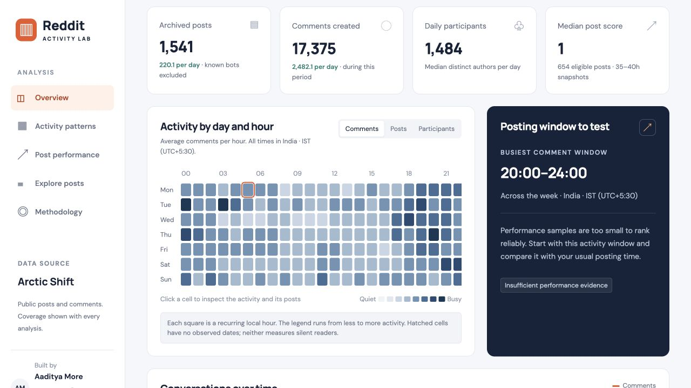
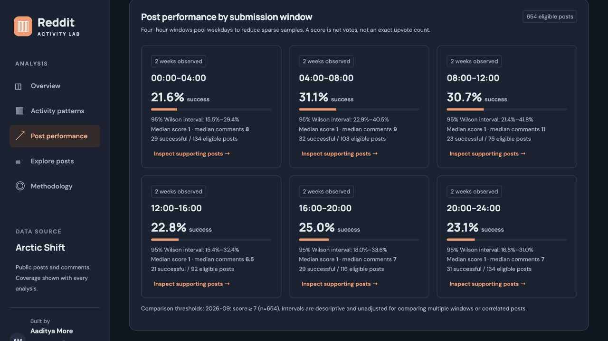
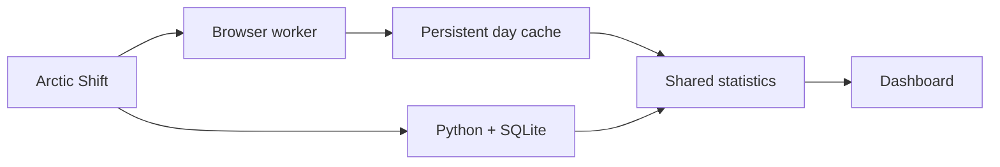

<div align="center">

# Reddit Activity Lab

**When to post. Where to start.**

Find posting windows worth testing using real subreddit activity and post performance.

[**Open the dashboard ↗**](https://lab.aadityamore.com/reddit/) · [Read the findings](docs/initial-report.md) · [Methodology](docs/methodology.md)

JavaScript · Web Workers · IndexedDB · Python · SQLite · Vercel

</div>

<a href="https://lab.aadityamore.com/reddit/">
  <picture>
    <source media="(prefers-color-scheme: dark)" srcset="docs/images/overview-dark.jpg">
    
  </picture>
</a>

<p align="center"><sub>Actual dashboard captures · r/ClaudeAI · 6–12 September 2026 · Asia/Kolkata</sub></p>

## Explore your community

- **Find a subreddit.** Search matching names, choose recent communities, or enter any name covered by Arctic Shift.
- **See when activity happens.** Compare comment, post, and distinct-participant heatmaps, trends, and competing submissions.
- **Compare post outcomes.** Inspect median score, median comments, success rates, sample sizes, and uncertainty by submission window.
- **Plan a posting experiment.** Follow recommendations back to their evidence and inspect the supporting posts.
- **Pick up where you left off.** The page includes a dated summary and restores your last saved analysis. Archive downloads start only after you change the analysis or request an update. Refresh, cancel, retry, or clear local data.

IST by default, eight timezones, automatic light/dark mode, and a manual theme switch. On phones, bottom navigation, expandable filters, and post evidence cards keep the dashboard usable at small widths.

<details>
<summary><strong>See post-performance analysis in dark mode</strong></summary>



</details>

## Run locally

Requires **Node.js 18+**, **Python 3.9+** for tests and the offline pipeline, and a modern browser. No API key, Reddit login, or npm dependency installation is needed.

```sh
git clone https://github.com/aaditya-v-more/reddit-activity-lab.git
cd reddit-activity-lab
npm test
npm run dev
```

Open **[localhost:4317](http://127.0.0.1:4317)**. Start with seven days; use one day for busy communities. `npm run build` creates the deployable site in `.output/`.

## Built to be inspectable

The original study processed **263,652 unique records** across r/ClaudeAI, r/ClaudeCode, and r/ollama. Its [report](docs/initial-report.md) covers **40 complete IST days**, from 28 July to 5 September 2026.



Acquisition deduplicates records, retains request hashes and timestamps, and rejects incomplete intervals. The same statistical engine powers the dashboard, tests, and reports. **55 tests run without downloaded records**, with an additional integration test for local study exports. Coverage includes pagination, IST/DST boundaries, cache recovery, confidence intervals, and temporal selection leakage.

The frontend has **zero runtime npm dependencies**. Analysis runs in a worker; a scoped Vercel relay handles failed direct archive connections. Raw datasets and credentials stay out of Git and deployed assets.

## What the data can tell you

Activity counts describe posts, comments, and participating authors—not silent readers or people online. Score is Reddit's net voting metric. Performance comparisons use known **35–40-hour snapshots**, not first-day views or exact upvotes. Timing associations do not establish causation.

Any covered subreddit can be requested, within **93 days, 200,000 records, and 350 requests per acquisition**. Archive coverage varies; opening the site makes no archive requests, and saved results remain visible during requested updates or outages.

| Read more                                         | What's inside                                            |
| ------------------------------------------------- | -------------------------------------------------------- |
| [Architecture & development](docs/development.md) | Source map, pipeline commands, starter generation        |
| [Methodology](docs/methodology.md)                | Cohorts, success thresholds, uncertainty, limitations    |
| [Sources & coverage](docs/sources.md)             | Arctic Shift research and archive availability           |
| [Verification](docs/verification.md)              | Data reconciliation, regression tests, browser checks    |
| [Hosting & scale](docs/hosting.md)                | Vercel Hobby limits, freshness, deployment, alternatives |
| [Data handling](docs/data-policy.md)              | Local storage, privacy, content rights                   |

---

Built by **[Aaditya More](https://www.linkedin.com/in/aadityavmore/)** · [GitHub](https://github.com/aaditya-v-more)
