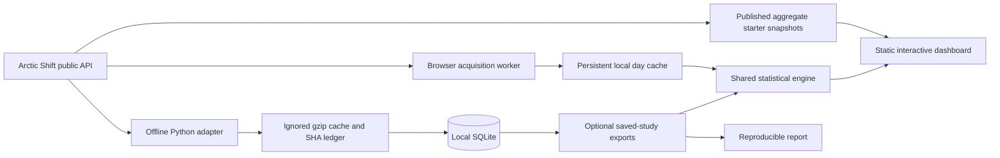

# Architecture and development

[Project overview](../README.md) · [Methodology](methodology.md) · [Hosting](hosting.md)

## Local setup

Use Node.js 18+, Python 3.9+, and a modern browser with Web Workers, IndexedDB, Web Crypto, and IANA timezone support. There are no runtime npm dependencies. Offline acquisition also requires `curl`.

```sh
git clone https://github.com/aaditya-v-more/reddit-activity-lab.git
cd reddit-activity-lab
npm test
npm run dev
```

Open [localhost:4317](http://127.0.0.1:4317). The development server runs the same scoped relay as production. Set `REDDIT_LAB_PORT` to use another port.

The initial HTML embeds a dated starter analysis and the dashboard restores the device's last saved result when available. Neither startup nor idle time contacts the archive. Choose a subreddit, inclusive local dates, and a timezone. The worker reuses cached summaries and acquires missing coverage; Refresh data explicitly updates saved records. Start with seven days, or one day for very active communities. First acquisitions can take minutes; completed days are reusable. The current local day is excluded.

## Data flow



The browser worker requests one page at a time, spaces calls, reports progress, and uses bounded retries. It overlaps timestamp boundaries and deduplicates IDs, retaining newer observations. Both posts and comments must finish before a local day's anonymous aggregate enters the cache. A capped or failed interval never becomes a complete analysis.

Local-day boundaries follow IANA calendar rules, including IST's half-hour offset and DST's repeated or missing hours. Date partitions allow recent days to refresh without downloading the entire selected interval again. See [methodology](methodology.md) for participant unions, bot exclusions, and performance eligibility.

Completed days and analyses persist in IndexedDB. Stale data remains visible during refresh or failure. The app does not evict old results to save new ones; browser quotas and site-data removal still apply. **Clear local data** also clears recent subreddit choices, while retaining the theme preference. See [data handling](data-policy.md) for exactly what is stored and [hosting](hosting.md) for refresh intervals and acquisition limits.

## Source map

`dist/` contains authored source. It is not disposable build output.

| Layer                                          | Files                                                               |
| ---------------------------------------------- | ------------------------------------------------------------------- |
| Acquisition and normalization                  | `dist/archive.js`                                                   |
| Background execution and persistent cache      | `dist/archive-worker.js`                                            |
| Statistics shared by UI, tests, and reports    | `dist/analysis.js`                                                  |
| Interface and theme                            | `dist/app.js`, `dist/index.html`, `dist/style.css`, `dist/theme.js` |
| Subreddit discovery and ranking                | `dist/subreddit-picker.js`                                          |
| Scoped archive relay                           | `api/archive.js`                                                    |
| Local server and build allowlist               | `scripts/dev.mjs`, `scripts/build.mjs`                              |
| Offline acquisition, SQLite, and normalization | `pipeline/`                                                         |
| Starter summaries and report generation        | `scripts/starter.mjs`, `scripts/starter-page.mjs`, `scripts/report.mjs`                         |
| Automated verification                         | `tests/`                                                            |

Archive requests go directly to Arctic Shift first. If that connection fails, three fixed routes reach a stateless relay for post search, comment search, and subreddit discovery. Incoming cookies and authorization never go upstream. Acquisition and statistics stay in the browser worker.

`npm run build` copies an explicit asset allowlist to `.output/`, including anonymous starter summaries and excluding local study exports. The output is portable to static hosts; a host without the relay uses `ARCHIVE_RELAY=0 npm run build`. Production builds and deployment commands are documented in [hosting](hosting.md).

## Reproduce the original study

The original acquisition contains **263,652 unique records: 19,507 posts and 244,145 comments** across r/ClaudeAI, r/ClaudeCode, and r/ollama. Acquisition covers **27 July–6 September 2026 UTC**; the default analysis covers **28 July–5 September**, 40 complete IST days. The compressed response cache was 19.46 MB.

```sh
# Requires curl. Dates are UTC; end is exclusive.
python3 -m pipeline.acquire --subreddits ClaudeAI ClaudeCode ollama \
  --start 2026-07-27 --end 2026-09-07
python3 -m pipeline.export
python3 -m pipeline.validate
node scripts/report.mjs

# Rebuild from checksum-verified cached responses without network access.
python3 -m pipeline.rebuild

# Optional small reverse-order source checks.
python3 -m pipeline.validate --online
```

After exporting, the local UI offers **Saved six-week study** as a separate source. Hosted builds omit it. Safe reruns skip completed acquisitions, deduplicate overlap, and retain newer snapshots. Failed intervals do not receive completion flags. A fresh acquisition can differ from the original because archives change.

The source adapter is replaceable. Map score measurement timestamps only when the source supplies them; download time cannot establish a fixed-age outcome. Original findings remain separate from subsequent on-demand observations.

## Regenerate starter summaries

The default r/AskReddit summary covers **12 September 2026**. Its IST analysis includes 153,935 records before bot exclusions: 5,262 posts and 148,673 comments. Additional starter summaries cover **6–12 September 2026** for r/ollama, r/ClaudeAI, and r/ClaudeCode in eight bundled timezones. The three IST summaries represent **36,610 acquired records** before bot exclusions. Only anonymous aggregates and request provenance are published: no authors, post IDs, titles, or bodies.

```sh
# Acquire one completed day for the default r/AskReddit summary.
npm run starter

# Choose the completed day. STARTER_DAYS can expand the interval.
STARTER_END=2026-09-12 npm run starter

# Refresh the original smaller communities over seven days.
STARTER_COMMUNITIES=ollama,ClaudeAI,ClaudeCode STARTER_DAYS=7 npm run starter

# Bypass the generator's local acquisition cache.
npm run starter -- --refresh
```

The generator shares the on-demand normalizer, timezone boundaries, and statistics. The offline generator saves complete UTC sections of at most two hours under ignored `data/starter/` so retries reuse completed work. It caps the combined starter at 500,000 records; the browser retains its separate 200,000-record limit. Raw normalized responses stay under ignored `data/starter/`; publishable summaries live in `dist/starter/`. The website displays the snapshot period and acquisition dates, keeping the summary visible while an update runs or the source is unavailable.

## Verification

`npm test` runs 48 tests without downloaded records and one additional integration test when saved exports exist. It covers pagination ties, newer observations, failed-acquisition flags, moderation restoration, bot/deleted-author handling, distinct unions, IST/DST boundaries, cache freshness, relay scoping, Wilson intervals, weekly resampling, temporal selection leakage, and subreddit ranking.

Starter privacy checks reject individual-record fields and reconcile heatmaps, daily totals, and outcome cohorts. The original study's [audit](validation.json) records checksum verification, identity parity, and 12 reverse-order source checks. [Verification notes](verification.md) document browser checks and real-record acquisition beyond the starter communities. These checks validate processing of acquired records; they do not prove complete Reddit capture.
